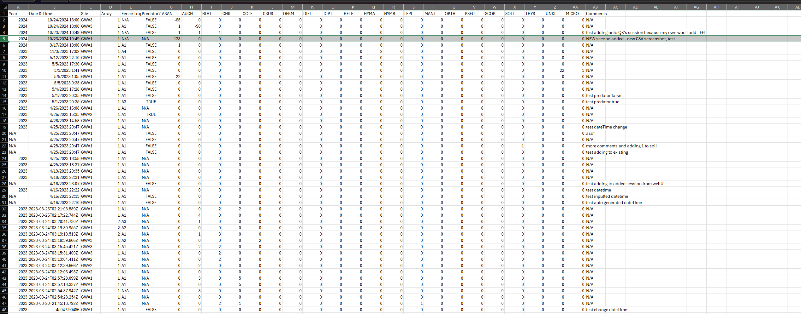

# Field Day App User Guide

Welcome to the Field Day App User Guide. This guide will help you understand how to use the Field Day application to its full potential.

---

## Table of Contents
1. [Introduction](#introduction)
2. [Getting Started](#getting-started)
    - [Creating an Account](#creating-an-account)
    - [Logging In](#logging-in)
3. [Application Features](#application-features)
    - [Dashboard Overview](#dashboard-overview)
    - [Scheduling Activities](#scheduling-activities)
    - [Managing Participants](#managing-participants)
    - [Monitoring Field Day Events](#monitoring-field-day-events)
    - [Notifications & Alerts](#notifications--alerts)
4. [Detailed Instructions](#detailed-instructions)
    - [How to Schedule an Event](#how-to-schedule-an-event)
    - [How to Add a New Participant](#how-to-add-a-new-participant)
    - [How to Track Participant Progress](#how-to-track-participant-progress)
5. [Account Settings](#account-settings)
    - [Editing Profile Information](#editing-profile-information)
    - [Changing Password](#changing-password)
    - [Privacy Settings](#privacy-settings)
6. [Data and Analytics](#data-and-analytics)
    - [Viewing Event Data](#viewing-event-data)
    - [Exporting Reports](#exporting-reports)
7. [Troubleshooting](#troubleshooting)
    - [Common Issues](#common-issues)
    - [FAQs](#faqs)
8. [Support & Feedback](#support--feedback)
    - [Contact Support](#contact-support)
    - [Providing Feedback](#providing-feedback)
9. [Legal Information](#legal-information)
    - [Terms of Service](#terms-of-service)
    - [Privacy Policy](#privacy-policy)
10. [Appendix](#appendix)
- [Glossary of Terms](#glossary-of-terms)
- [Additional Resources](#additional-resources)

---

# Introduction
Welcome to Field Day! Field Day is an application sponsored by Dr. Heather Bateman, a biologist and researcher at Arizona State University.

This application is split up into two different entities:
- Field Day Desktop App
- Field Day PWA (mobile application)

This guide extensively covers how to use the Desktop application. A guide for the mobile app is still a work in progress!

# Getting Started

### Creating an Account
Field Day is currently set up to only allow ASU emails to log in. Please sign in with your ASURITE ID.
Our desktop application also requires a password to access the data once you are authenticated through ASU.
Please reach out to Dr. Bateman for this password and access.

### Logging In
The Desktop Field Day app is located at : https://asu-field-day-webui.web.app/login

Sign in to this portal by hitting log in and logging in with your ASU-affiliated Google account.

## Application Features
### Dashboard Overview
This is main screen once you have authenticated through your ASU email. All tabs are different tables of different critters caught out in the field.

Currently, there are 7 different tabs:
1. Turtle
2. Lizard
3. Mammal
4. Snake
5. Arthropod
6. Amphibian
7. Session

Each tab

One of the most important things to take note here is the Data Source Tab:

This tab switches between which set of data to use. There are two selections: Live and Test
- Live is the live database. This is the most up-to-date data and the live data being collected in the field. Be careful when editing this data!
- Test is a test environment. These entries are mostly the development team testing out different features on the application to make sure they work. Change these entries to your heart's desire.

### Scheduling Activities
Instructions on how to schedule activities for the field day event.

### Managing Participants
Guide to adding, updating, and removing participants.

### Monitoring Field Day Events
How to monitor and track ongoing field day events in real-time.

### Notifications & Alerts
Overview of notifications and alert settings for timely updates.

## Detailed Instructions
### How to Schedule an Event
Step-by-step guide to scheduling an event.

### How to Add a New Participant
Instructions on adding a new participant to the field day.

### How to Track Participant Progress
Overview of tracking and viewing progress for each participant.

## Account Settings
### Editing Profile Information
How to edit and update your profile information.

### Changing Password
Steps to change your account password.

### Privacy Settings
Options for managing privacy settings within the app.

## Data and Analytics
### Viewing Event Data
Guide to accessing and analyzing event data.

### Exporting Reports
Instructions on exporting reports in various formats.

## Troubleshooting
### Common Issues
List of common issues and solutions.

### FAQs
Frequently Asked Questions about using the Field Day App.

## Support & Feedback
### Contact Support
How to reach the support team for help.

### Providing Feedback
Instructions for submitting feedback or suggestions.

## Legal Information
### Terms of Service
Link and information on the app’s terms of service.

### Privacy Policy
Overview of the app’s privacy policy.

## Appendix
### Glossary of Terms
Definitions of common terms used within the Field Day App.

### Additional Resources
Links and resources for further information.

---

Thank you for using the Field Day App. We hope this guide helps you get the most out of your experience!
