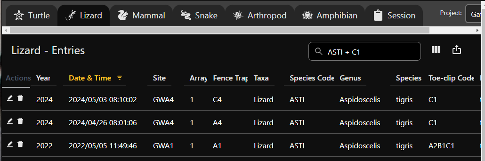

# Field Day App User Guide

Welcome to the Field Day App User Guide. This guide will help you understand how to use the Field Day application to its full potential.

---

## Table of Contents
1. [Introduction](#introduction)
2. [Getting Started](#getting-started)
    - [Creating an Account](#creating-an-account)
    - [Logging In](#logging-in)
3. [Application Features](#application-features)
    - [Dashboard Overview](#dashboard-overview)
    - [Managing Entries](#managing-entries)
    - [Editing The Table View](#editing-the-table-view)
    - [Searching For Entries](#searching-for-entries)
6. [Detailed instructions for Data Handling](#detailed-instructions-for-data-handling)
    - [Exporting Data](#exporting-data)
7. [Troubleshooting](#troubleshooting)
    - [Common Issues](#common-issues)
    - [FAQs](#faqs)
8. [Feedback](#support--feedback)
    - [Providing Feedback](#providing-feedback)

---

# Introduction
Welcome to Field Day! Field Day is an application sponsored by Dr. Heather Bateman, a biologist and researcher at Arizona State University.

Students at ASU graduating in Software Engineering develop and maintain this application through the degree Capstone course, SER 401 and 402.

This application is split up into two different entities:
- Field Day Desktop App
- Field Day PWA (mobile application)

This guide extensively covers how to use the Desktop application. A guide for the mobile app is still to come!

# Getting Started

### Creating an Account
Field Day is currently set up to only allow ASU emails to log in. Please sign in with your ASURITE ID.
Our desktop application also requires a password to access the data once you are authenticated through ASU.
Please reach out to Dr. Bateman for this password and access.

### Logging In
The Desktop Field Day app is located at : https://asu-field-day-webui.web.app/login

Sign in to this portal by hitting log in and logging in with your ASU-affiliated Google account.

# Application Features
### Dashboard Overview
This is main screen once you have authenticated through your ASU email. All tabs are different tables of different critters caught out in the field.

Currently, there are 7 different tabs:
1. Turtle
2. Lizard
3. Mammal
4. Snake
5. Arthropod
6. Amphibian
7. Session

Each tab is self-describing, as it contains the data for each critter species.

The Session tab is for the entries created during the current session. More on sessions *** HERE. *** ADD HYPERLINK.

One of the most important things to take note here is the Data Source Tab:

This tab switches between which set of data to use. There are two selections: Live and Test
- Live is the live database. This is the most up-to-date data and the live data being collected in the field. Be careful when editing this data!
- Test is a test environment. These entries are mostly the development team testing out different features on the application to make sure they work. Change these entries to your heart's desire.

### Managing Entries
All entries are available to be viewed on the desktop application. To edit/delete/alter in any way these entries, you can click the edit or delete button on the side of each entry under the "Actions" column.

For example, this Lizard entry has the edit button and delete button next to it. Clicking the edit button makes these fields editable:

Now you can edit whatever information you need. To save or discard these changes, hit the check or X button, respectively.

## Editing the Table View

If a certain page is too crowded, or has information you don't need to take into consideration at a certain point in time, fields are able to be removed from the table using the editor in the top right corner:

Clicking the three-card button, it shows this menu: (not all shown for image size purposes):

As an example, if you only wanted to view Year, Date & Time, and Site, you can deselect all options. This is what the page would look like after:

### Searching For Entries 
Searching for different critters is now easier than ever. Using the search bar, you can search for multiple terms to find the exact entry you need.

For example: In the lizard tab, say you wanted to find lizards of species code ASTI with toe-clip code C1.

First, type ASTI into the search box. For any other term you want to search, add a +. i.e.:

# Detailed Instructions For Data Handling

### Exporting Reports

At the bottom of any page in the Field Day app, you can find 4 buttons:

The button that looks like an arrow coming out of a rectangle, or, this one: is the Export button.

Click this button to bring up a dialogue to select which data to convert to a CSV document. This document can easily be opened in Excel or other data applications for further processing.

Any of the data on the Field Day app can be generated into this file, as shown in the menu:

You may also choose to only export from the current session or the data already saved to the database.

After clicking "Generate CSV", the CSV file will be downloaded to your computer.
## Troubleshooting
### Common Issues
To be written.

### FAQs
Frequently Asked Questions about using the Field Day App.

-- TODO: Ask Heather about how her team uses the app and any questions they ask her on the day to day.

## Support & Feedback

Please reach out to Dr. Bateman with any requests to make this app a better place for all of us!

Any change requests will greatly help out future capstone teams and their work in developing and maintaining this app :)

---

Last Updated: 11/3/2024
