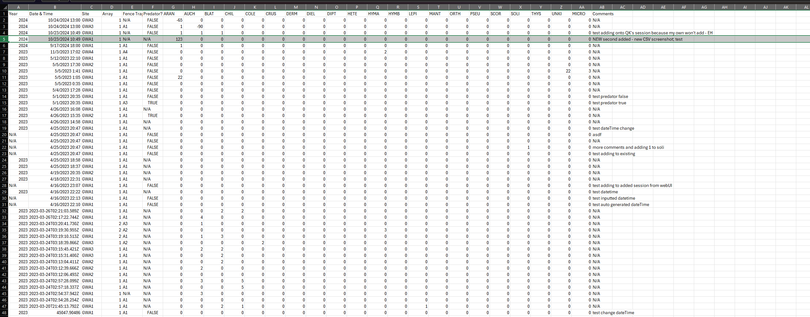

Figuring out why Arthropod taxonomy may or may not (?) effect past sessions:

## Some things:
- Adding my own session and creating (any) new data entry does not populate the array
    - I, however, CAN add critters/animals to other sessions just not my own
    - Adding this as a bug in taiga, but, not in the scope of task 183.

## Bug Description:
Adding arthropod data effect (in what way?) past session data.

## Steps to reproduce:
.. none, so far, see below:

## Main obstacles:
1. Cannot create my own session to add any critters
2. Exporting to CSV doesn't show any mess ups in history .. ?

## Exploration:
After adding an arthropod to another session: (highlighted row is what I added)

Everything seems to be in order.

Adding another arthropod to the same session, and downloading the CSV a second time:

It's out of order, sure, but nothing is out of the ordinary.
